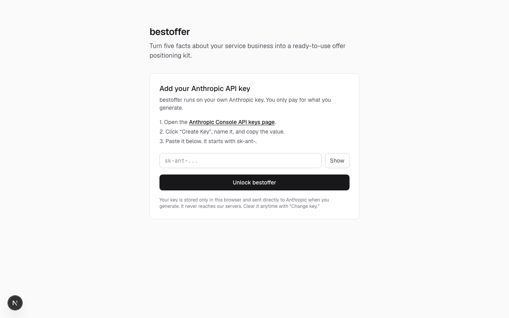

# bestoffer

Turn five facts about your service business into a ready-to-use **offer positioning kit** — ideal customer, core problem, clear offer, homepage headline, CTA, an email sequence, an SMS sequence, and three ad hooks. Written in a clear, direct, human tone, no hype.

bestoffer is **bring-your-own-key**: you paste your own Anthropic API key, it's stored only in your browser, and requests go straight to Anthropic. Nothing touches a server of ours, and there's no sign-up.

## Features

- **Bring your own Anthropic key** — stored in your browser only, never sent anywhere but Anthropic.
- **Autofill from your website** — paste your domain and the model reads your site (via Anthropic's server-side web tools) to fill in the business fields for you. Review and edit before generating.
- **One-shot generation** — five inputs plus your contact details produce a full positioning kit.
- **Email + SMS sequences** woven with your name, email, and phone so they're ready to send.
- **Model picker** — Sonnet by default for speed and cost; upgrade to Opus for higher-quality copy.
- **Copy per section** or **copy all as Markdown** to drop the whole kit into another tool.
- Fully **stateless** — no accounts, no database, no saved history.

## Screenshot



## Install

```bash
git clone https://github.com/Still-InFrame/day-19-bestoffer.git
cd day-19-bestoffer
npm install
npm run dev
```

Then open http://localhost:3000 and paste your Anthropic API key (get one at [console.anthropic.com](https://console.anthropic.com/settings/keys)).

## Stack

Next.js (App Router) · TypeScript · Tailwind CSS · Anthropic SDK (client-side, BYOK)

---

Part of Savion's 100 Day AI Build Challenge — [see all the builds](https://www.100dayaichallenge.com/share/savion).
